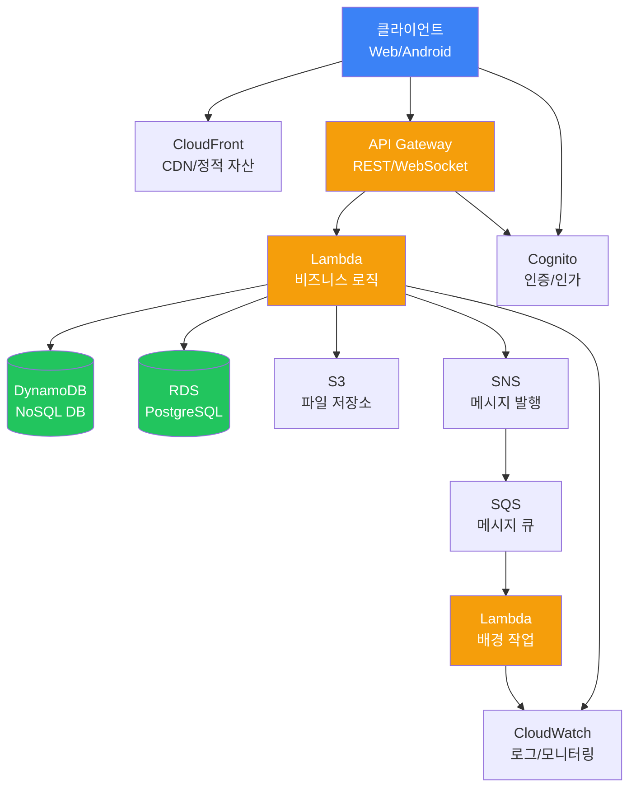
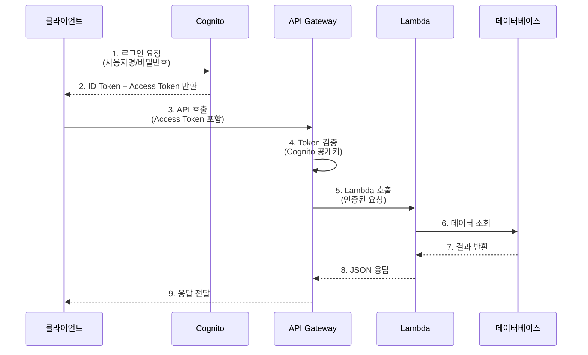
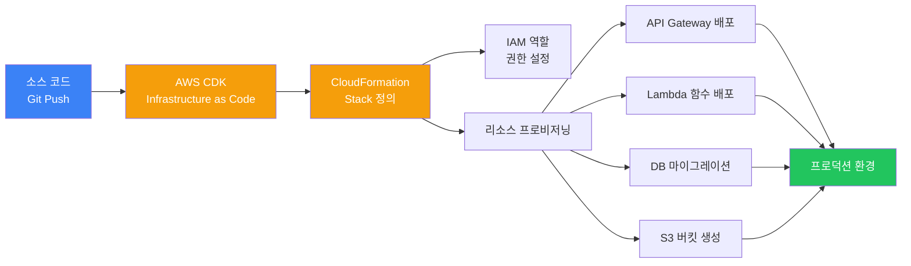

# AWS 아키텍처

## 전체 구조

## 인증 플로우

## 배포 플로우

## 컴포넌트 설명

### API Gateway
클라이언트의 모든 API 요청의 진입점입니다. REST API와 WebSocket을 지원하며, 요청 검증, 인증, 속도 제한 등을 처리합니다.

### Lambda
서버리스 컴퓨팅입니다. API 요청에 대한 비즈니스 로직을 처리하고, 이벤트 기반으로 자동 실행됩니다.

### Cognito
사용자 인증과 권한 관리를 담당합니다. 사용자 풀과 ID 풀을 통해 복잡한 인증 정책을 구현할 수 있습니다.

### DynamoDB
NoSQL 데이터베이스입니다. 확장성이 뛰어나고, 실시간 데이터 처리에 적합합니다.

### RDS
관계형 데이터베이스(PostgreSQL, MySQL 등)입니다. 복잡한 쿼리와 트랜잭션이 필요할 때 사용합니다.

### S3
객체 스토리지입니다. 파일 업로드, 정적 웹사이트 호스팅, 백업 등에 사용됩니다.

### SNS/SQS
메시지 큐와 발행-구독 패턴을 지원합니다. Lambda 함수 간의 비동기 통신에 사용됩니다.

### CloudWatch
로그, 메트릭, 알람을 관리하는 모니터링 서비스입니다.

## 장점과 단점

| 장점 | 단점 |
|------|------|
| 무한한 확장성과 안정성 | 학습 곡선이 가파름 |
| 다양한 서비스 조합 가능 | 비용 계산이 복잡함 |
| 엔터프라이즈 수준의 보안 | 구성이 복잡할 수 있음 |
| IAM을 통한 세밀한 권한 제어 | vendor lock-in |
| 글로벌 인프라 | 무료 티어 제한적 |
| 24/7 기술 지원 | Cold start 지연 (Lambda) |
