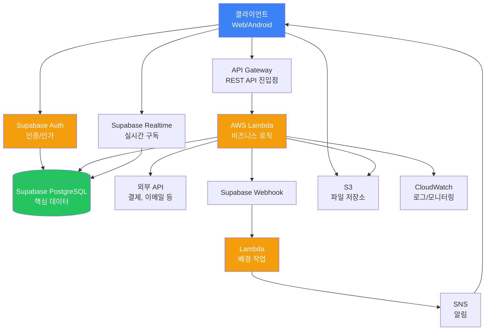
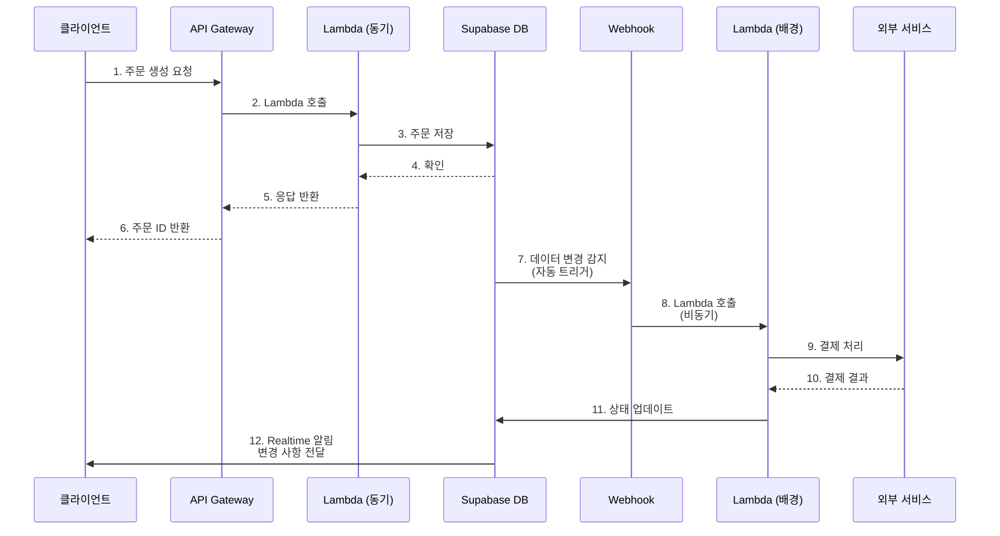

# 하이브리드 아키텍처 (Supabase + AWS)

## 전체 구조



## 데이터 흐름 (Webhook 기반 비동기 처리)



## Supabase vs Lambda 역할 분리

| 계층 | Supabase | AWS Lambda | 설명 |
|------|----------|-----------|------|
| **인증/권한** | ✓ | ✗ | Supabase Auth로 일원화 |
| **데이터 저장** | ✓ | ✗ | PostgreSQL + RLS로 안전성 보장 |
| **간단한 API** | ✓ | △ | Edge Functions vs Lambda (선택 사항) |
| **복잡한 비즈니스 로직** | ✗ | ✓ | Lambda로 처리 |
| **외부 서비스 연동** | ✗ | ✓ | 결제, 이메일, SMS 등 |
| **실시간 기능** | ✓ | ✗ | Realtime으로 구현 |
| **배경 작업** | △ | ✓ | Webhook + Lambda 조합 |
| **파일 저장** | △ | ✓ | S3 선호 (대규모) |

## 언제 하이브리드를 선택하는가?

### Supabase 단독 선택
- 프로토타입/MVP 빠른 구축
- 실시간 협업 기능 필요
- 복잡한 쿼리가 주요 요구사항
- 팀 규모가 작음

### AWS 단독 선택
- 극도의 확장성 필요
- 복잡한 워크플로우 처리
- 엔터프라이즈 규모의 보안 요구
- 기존 AWS 인프라와 통합

### 하이브리드 선택
- 빠른 개발과 강력한 백엔드 필요
- 실시간 기능 + 외부 서비스 연동
- 중소 규모에서 엔터프라이즈로 확장 예상
- 비용 최적화와 성능 균형

## 하이브리드 구성 예시

### 1단계: 핵심 데이터 (Supabase)
```sql
-- Supabase의 users 테이블
CREATE TABLE users (
  id uuid PRIMARY KEY,
  email text UNIQUE NOT NULL,
  profile jsonb,
  created_at timestamptz DEFAULT now()
);

-- RLS 정책: 자신의 데이터만 접근
CREATE POLICY "Users can view own data" 
  ON users FOR SELECT 
  USING (auth.uid() = id);
```

### 2단계: 비즈니스 로직 (AWS Lambda)
```typescript
// Lambda 함수: 결제 처리
export const handler = async (event) => {
  const { userId, amount } = event.body;
  
  // Supabase에서 사용자 정보 조회
  const user = await supabase
    .from('users')
    .select('*')
    .eq('id', userId)
    .single();
  
  // 외부 결제 API 호출
  const payment = await stripe.charges.create({
    amount,
    customer: user.stripe_customer_id
  });
  
  // 결과를 Supabase에 저장
  await supabase
    .from('payments')
    .insert({ user_id: userId, status: payment.status });
  
  return { success: true, payment };
};
```

### 3단계: Webhook 연결
```javascript
// Supabase: 주문 생성 시 Lambda 호출
supabase
  .from('orders')
  .on('INSERT', payload => {
    // AWS Lambda 호출
    fetch('https://api.example.com/process-order', {
      method: 'POST',
      body: JSON.stringify(payload)
    });
  })
  .subscribe();
```

## 장점과 단점

| 장점 | 단점 |
|------|------|
| 빠른 개발 + 강력한 백엔드 | 운영 복잡도 증가 |
| 비용 효율적 (각각의 강점만 활용) | 두 플랫폼의 학습 필요 |
| 유연한 확장성 | 디버깅이 어려울 수 있음 |
| 실시간 기능 + 외부 연동 가능 | 데이터 일관성 관리 필요 |
| 벤더 종속성 감소 | 배포 파이프라인 복잡함 |
| 마이그레이션 용이 | 네트워크 지연 추가 |

## 주의사항

### 데이터 일관성
Supabase와 Lambda 간의 데이터 동기화가 중요합니다. Webhook을 사용한 이벤트 기반 아키텍처로 최종 일관성을 보장하세요.

### 인증 통합
Supabase Auth의 JWT를 Lambda에서도 검증해야 합니다. API Gateway 인증 레이어로 통합하세요.

### 비용 관리
Supabase의 API 호출과 Lambda 실행 비용을 모니터링하세요. CloudWatch와 Supabase 메트릭을 함께 확인하세요.
