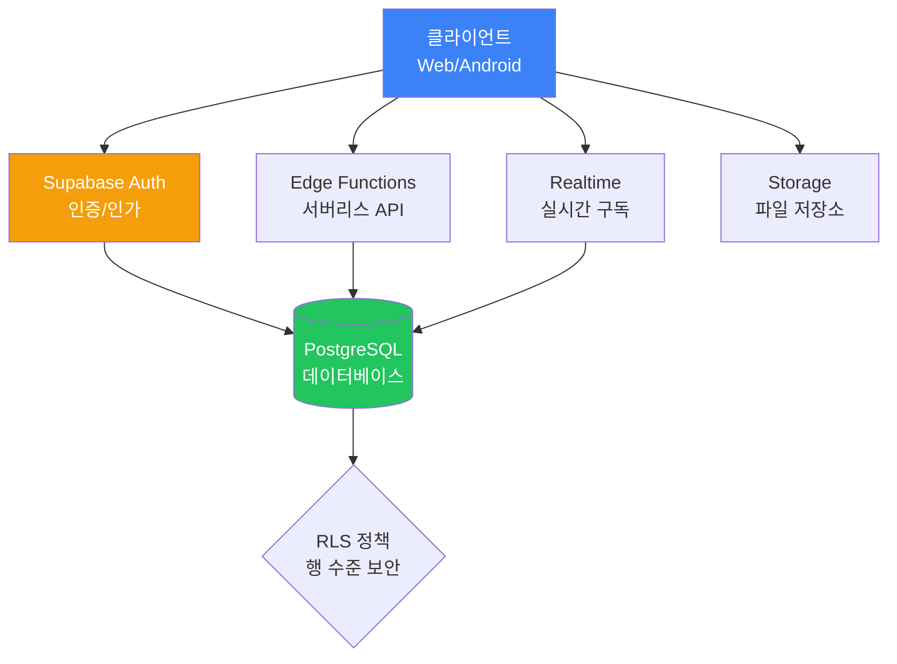
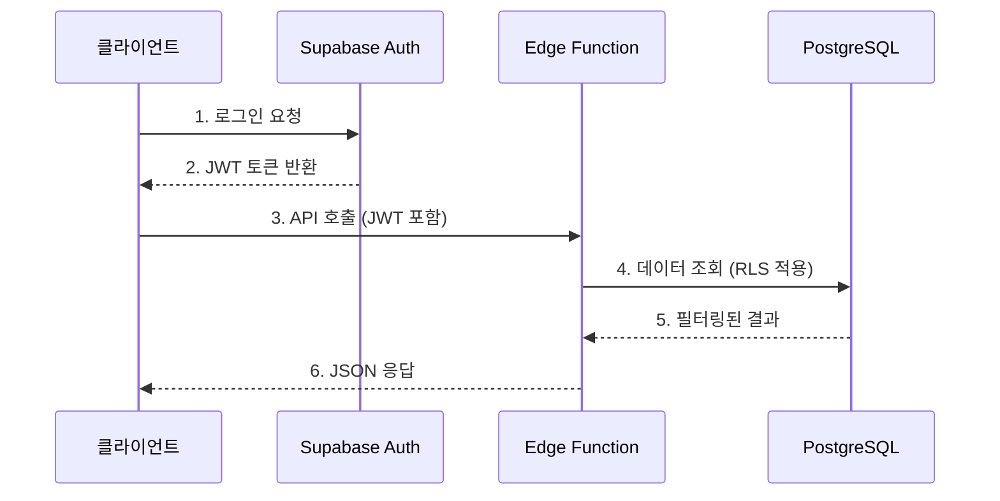

# Supabase 아키텍처

## 전체 구조

## 데이터 흐름

## 컴포넌트 설명

### PostgreSQL 데이터베이스
Supabase의 핵심입니다. 모든 데이터가 PostgreSQL에 저장되며, Row Level Security(RLS)로 행 수준의 접근 제어를 합니다.

### Supabase Auth
이메일/비밀번호, Google, GitHub 등 다양한 인증 방식을 지원합니다. JWT 토큰을 발행하여 API 호출 시 사용합니다.

### Edge Functions
Deno 기반의 서버리스 함수입니다. 복잡한 비즈니스 로직을 서버에서 처리할 때 사용합니다.

### Realtime
PostgreSQL의 변경사항을 실시간으로 클라이언트에 전달합니다. 채팅, 알림 등에 적합합니다.

### Storage
파일 업로드/다운로드를 위한 S3 호환 스토리지입니다. 이미지, 문서 등을 저장합니다.

## 장점과 단점

| 장점 | 단점 |
|------|------|
| 빠른 시작 (5분 만에 백엔드 구축) | 복잡한 비즈니스 로직 처리 제한적 |
| PostgreSQL의 강력한 기능 활용 | Edge Functions 콜드 스타트 |
| RLS로 보안 정책 DB 레벨 적용 | 자체 호스팅 시 운영 부담 |
| 실시간 기능 내장 | vendor lock-in |
| 무료 티어 제공 | 대규모 트래픽 시 비용 증가 |
